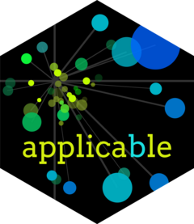

<!-- README.md is generated from README.Rmd. Please edit that file -->

```{r, include = FALSE}
knitr::opts_chunk$set(
  collapse = TRUE,
  comment = "#>",
  fig.path = "man/figures/README-",
  out.width = "100%"
)

options(rlang__backtrace_on_error = "reminder")

```

# applicable 

<!-- badges: start -->
[](https://www.tidyverse.org/lifecycle/#experimental)
[](https://cran.r-project.org/package=applicable)
](https://github.com/tidymodels/applicable/actions)
<!-- badges: end -->

## Introduction

There are times when a model's prediction should be taken with some skepticism. For example, if a new data point is substantially different from the training set, its predicted value may be suspect. In chemistry, it is not uncommon to create an "applicability domain" model that measures the amount of potential extrapolation new samples have from the training set. applicable contains different methods to measure how much a new data point is an extrapolation from the original data (if at all).

## Installation

You can install the released version of applicable from [CRAN](https://CRAN.R-project.org) with:

``` r
install.packages("applicable")
```

Install the development version of applicable from [GitHub](https://github.com/) with:

``` r
# install.packages("devtools")
devtools::install_github("tidymodels/applicable")
```

## Vignettes

To learn about how to use applicable, check out the vignettes:

- `vignette("binary-data", "applicable")`: Learn different methods to analyze binary data.

- `vignette("continuous-data", "applicable")`: Learn different methods to analyze continuous data.

## Contributing

This project is released with a [Contributor Code of Conduct](https://contributor-covenant.org/version/2/0/CODE_OF_CONDUCT.html). By contributing to this project, you agree to abide by its terms.

- For questions and discussions about tidymodels packages, modeling, and machine learning, please [post on RStudio Community](https://rstd.io/tidymodels-community).

- If you think you have encountered a bug, please [submit an issue](https://github.com/tidymodels/applicable/issues).

- Either way, learn how to create and share a [reprex](https://rstd.io/reprex) (a minimal, reproducible example), to clearly communicate about your code.

- Check out further details on [contributing guidelines for tidymodels packages](https://www.tidymodels.org/contribute/) and [how to get help](https://www.tidymodels.org/help/).
